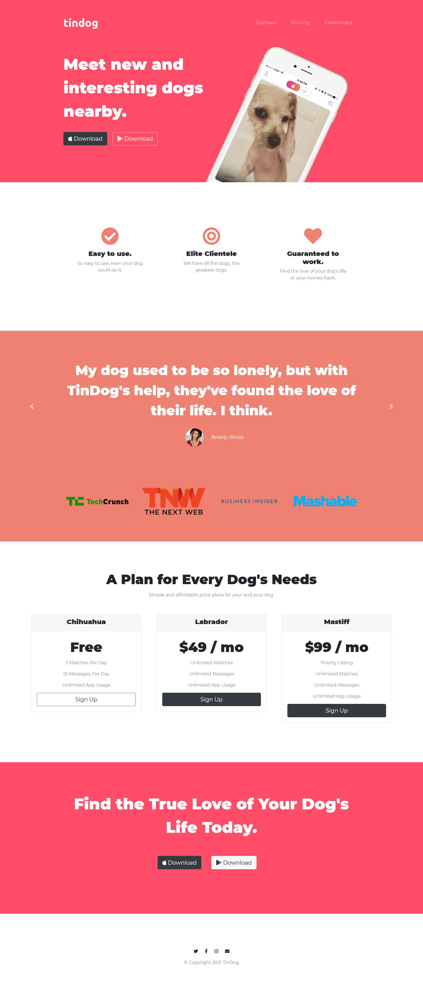

# Course Project - TinDog
This is a project that belongs to The Complete Web Development Bootcamp course by Angela Yu

## Table of contents

- [Overview](#overview)
  - [The challenge](#the-challenge)
  - [Screenshot](#screenshot)
  - [Links](#links)
- [My process](#my-process)
  - [Built with](#built-with)
  - [What I learned](#what-i-learned)
  - [Continued development](#continued-development)
  - [Useful resources](#useful-resources)
- [Author](#author)
- [Acknowledgments](#acknowledgments)

## Overview

### The challenge

Users should be able to:

✔️- See a responsive website
✔️- Scroll through the carousel
✔️- See hover states for interactive elements

### Screenshot




### Links

- Live Site URL: [TinDog](https://tindog-download-page.netlify.app/)

### Built with

- Semantic HTML5 markup
- CSS custom properties
- Bootstrap 4

### What I learned

I learnt about bootstrap classes and components, such as the carousel one. For example:
```css
<section id="testimonials">

    <div id="testimonial-carousel" class="carousel slide" data-ride="carousel">
      <div class="carousel-inner">
        <div class="carousel-item active">
          <h2>I no longer have to sniff other dogs for love. I've found the hottest Corgi on TinDog. Woof.</h2>
          
          <em>Pebbles, New York</em>
        </div>
        <div class="carousel-item">
          <h2 class="testimonial-text">My dog used to be so lonely, but with TinDog's help, they've found the love of their life. I think.</h2>
          
          <em>Beverly, Illinois</em>
        </div>
      </div>
      <a class="carousel-control-prev" href="#testimonial-carousel" role="button" data-slide="prev">
        <span class="carousel-control-prev-icon" aria-hidden="true"></span>
        <!-- aria-hidden: navigator reader ignores the button -->
        <span class="sr-only">Previous</span> <!-- Visual impaired people reading -->
      </a>
      <a class="carousel-control-next" href="#testimonial-carousel" role="button" data-slide="next">
        <span class="carousel-control-next-icon" aria-hidden="true"></span>
        <span class="sr-only">Next</span> <!-- Visual impaired people reading -->
      </a>
    </div>

  </section>


  <!-- Press -->

  <section id="press">
    
    
    
    

  </section>
```
I also learnt about organizing the elements in order to see a better looking website.

### Continued development

I have to practice more about the CSS Layout and Bootstrap classes in order to retain more information.

### Useful resources

-- [The 2021 Complete Web Development Bootcamp Course](https://www.udemy.com/course/the-complete-web-development-bootcamp/) - This is the course I've been following along in order to build this website.
- [MDN Media Queries](https://developer.mozilla.org/en-US/docs/Web/CSS/Media_Queries/Using_media_queries) - This helped me on changing the background image depending on the screen size.

## Author

- Website - [Iván Pita](https://muzu-u.github.io/cv/)
- Facebook - [Iván Pita](https://www.facebook.com/ivan.pita.unu/)
